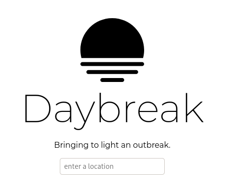

<

# Daybreak

> Bringing to light an outbreak

Daybreak is an online tool that when given a location can predict a "danger quotient" for risk of the Wuhan Corona virus (2019-nCoV). This is achieved through the use of logistic regression done on the [John Hopkins University dataset](https://www.kaggle.com/brendaso/2019-coronavirus-dataset-01212020-01262020).

## Set Up

1. have python 3+ and virtualenv installed
2. clone the repo: `git clone https://github.com/prydt/daybreak`
3. set up virtual environment `virtualenv env`
4. install required packages `./env/bin/pip i -r requirements.txt`
5. run the server `./env/bin/flask run` and go to the site! (localhost:5000/index.html)

This project was made in 24hr at the HackUNT hackathon! Made by Pranoy Dutta, Pranay Gosar, Pranav Logan.
